# mentorship_week_one

In This Task I applied OOP Principles with SOLID by:
** SRP in
1-orderModel => "Encapsulation" to set and get the private field.
2-customerModel
3-drinkModel 
every class is only responsible for representing the status of this fields.

** Abstract + (Polymorphism + OCP) in
1-Class Drink + Subclasses To be  Open for extension, closed for modification

** Dependency Inversion Principle (DIP) + Encapsulation + Dependency Injection + Abstract in
1-orderManager depend on orderRepository
--using instance of orderRepository private to prevent any outside editing
--using this instance in the constructor applied Dependency Injection

## Diagram

